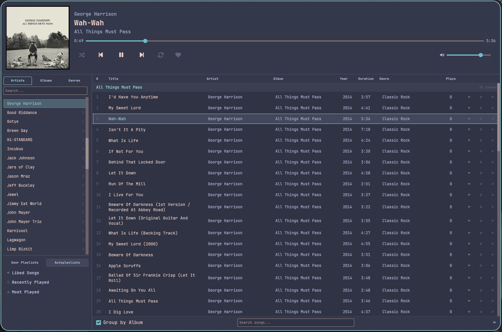

# omatunes

A native Wayland music player written in Rust, built for [Omarchy](https://omarchy.org/) / Hyprland rices. Follows the active Omarchy theme automatically — colors update live when you switch themes.

`omatunes` is a customized fork of [sheep-farm/lavanda](https://github.com/sheep-farm/lavanda) by [Balthazzahr](https://github.com/Balthazzahr).



---

## Key Features

- **Wide Audio Format Support**: Plays MP3, FLAC, OGG, Opus, WAV, AAC, M4A, AIFF, and more natively via the high-performance [Symphonia](https://github.com/pdeljanov/Symphonia) library.
- **100% Offline & Privacy-First**: Zero tracking, zero background telemetry, and no network requirements. It logs, saves, and compiles your play counts, statistics, and leaderboard records locally.
- **Live Omarchy Theme Switching**: Automatically maps your active system theme (`Catppuccin`, `Nord`, `Gruvbox`, etc.) to the UI palette live in under 3 seconds. No app restarts required.
- **Native Wayland & Lightweight**: Built in native Rust for Wayland compositors (like Hyprland) using the Iced GUI toolkit. Extremely fast startup and low resource consumption.
- **Rich Waybar MPRIS Integration**: Pre-packaged with local Waybar status scripts (`scripts/omatunes_text.py`). Provides styled progress bars, listening history milestones, and interactive tooltip stats directly on your status bar.
- **Folder-Based Music Library**: No forced file re-organization. respects and reads your existing `~/Music` subdirectory structure exactly as it is.
- **High-Performance Incremental Scanner**: Instantly scans your library on startup by checking file modification timestamps (`mtime` cache) to skip unchanged tracks.
- **Advanced Bulk Metadata (ID3) Editing**: Select multiple tracks, edit fields selectively using checkboxes, utilize predictive library-based autocomplete suggestions, and apply tag updates across entire albums.
- **Customizable Columns**: Toggle visibilities or re-order columns (Track #, Title, Artist, Album, Plays, Duration) via a right-click header menu, saving preferences to your local database.
- **Playlists & Smart Autoplaylists**: Build custom playlists on the fly, or use automatic smart lists (`Liked Songs`, `Recently Played`, `Most Played`) that update live as you listen.
- **MPRIS2 Server Support**: Integrates natively with `playerctl` and other system D-Bus audio widgets.

---

## Requirements

| Requirement | Notes |
|---|---|
| Rust ≥ 1.75 | `rustup` recommended |
| A Nerd Font | `JetBrainsMono Nerd Font Mono` by default; any Nerd Font works |
| PipeWire or PulseAudio | Audio output via cpal |
| D-Bus session bus | For MPRIS2 (`DBUS_SESSION_BUS_ADDRESS` must be set) |
| Wayland compositor | Tested on Hyprland; works on any wlroots compositor |

---

## Installation & Setup

### 1. Install the Player Binary

#### Option A: Download Pre-compiled Release (Recommended)
Download the pre-compiled binary directly from the latest GitHub release:
```bash
mkdir -p ~/.local/bin
curl -L -o ~/.local/bin/omatunes https://github.com/Balthazzahr/omatunes/releases/latest/download/omatunes
chmod +x ~/.local/bin/omatunes
```

#### Option B: Compile from Source
If you prefer to compile manually:
```bash
git clone https://github.com/Balthazzahr/omatunes
cd omatunes
cargo build --release
mkdir -p ~/.local/bin
cp target/release/omatunes ~/.local/bin/omatunes
```

### 2. Install Waybar Integration Scripts
To set up the Waybar module and stats dashboard, copy the scripts to your scripts folder and make them executable:
```bash
mkdir -p ~/.local/bin/omatunes_scripts
cp scripts/omatunes_text.py ~/.local/bin/omatunes_scripts/omatunes_text.py
cp scripts/omatunes_volume.sh ~/.local/bin/omatunes_scripts/omatunes_volume.sh
chmod +x ~/.local/bin/omatunes_scripts/omatunes_text.py
chmod +x ~/.local/bin/omatunes_scripts/omatunes_volume.sh
```

### 3. (Optional) Setup Auto-Sync Service
If you want to push local code edits automatically to your GitHub fork:
```bash
mkdir -p ~/.local/bin/omatunes_scripts
cp scripts/git_sync.sh ~/.local/bin/omatunes_scripts/git_sync.sh
chmod +x ~/.local/bin/omatunes_scripts/git_sync.sh

mkdir -p ~/.config/systemd/user
cp scripts/omatunes-sync.service ~/.config/systemd/user/omatunes-sync.service
systemctl --user daemon-reload
systemctl --user enable --now omatunes-sync.service
```

---

## Configuration

omatunes generates `~/.config/omatunes/config.toml` on first run. Edit it to configure paths and behaviors:

```toml
# ~/.config/omatunes/config.toml

# Path to your music library
music_dir = "~/Music"

# Initial volume (0.0 = mute, 1.0 = 100%)
volume = 0.8

# Start session with shuffle/repeat
shuffle = false
repeat = false

# Language ("auto", "en", "pt_BR", "es")
language = "auto"

# Seek / Volume steps
seek_step = 5
volume_step = 0.05
```

The library database is stored at `~/.local/share/omatunes/omatunes.db`. If you need to force a full clean re-scan, you can delete this file.

---

## User Guide

Welcome to `omatunes`! Here is how to get started using the player, from basic navigation to advanced library management.

### 1. Library Synchronization
On first launch, `omatunes` will automatically scan your configured music directory (defaults to `~/Music`). 
- **Lightweight Incremental Scanner**: It checks file modification timestamps (`mtime`) to avoid scanning unchanged files, loading even massive libraries instantly.
- **Dynamic Database**: Any files you add, rename, edit, or delete inside your music directory will automatically sync to the database (`~/.local/share/omatunes/omatunes.db`) when `omatunes` starts.

### 2. Browsing & Filtering
You can navigate your library using the sidebar panel on the left:
- **Artists, Albums, and Genres Tabs**: Click these folders to filter the track list. Each folder spans full-width with a clean flat tab styling.
- **Interactive Search**: Use the search input at the top of the sidebar to filter the lists by matching keywords instantly.

### 3. Playback Controls
- **Double-click a Track**: Starts playing the song.
- **Player Panel**: Located at the top. It displays the active track title, artist, and album. It also locks and displays the playing album art (enlarged by 20% for visibility).
- **Progress Bar & Seeking**: Click anywhere along the timeline bar to seek directly to that part of the track.
- **Volume & States**: Control the volume slider, and toggle shuffle or repeat directly in the player bar.

### 4. Custom & Automatic Playlists
Navigate to the bottom panel of the sidebar to manage your playlists:
- **User Playlists**: Click this tab to view your custom playlists. Create a new one by clicking the **New Playlist** button at the bottom of the list. Hovering over a playlist allows you to rename (pencil icon) or delete (trash can icon) it.
- **Autoplaylists**: Click this tab to view smart, self-updating lists:
  - *Liked Songs*: Aggregates all tracks you have favorited (by clicking the heart icon).
  - *Recently Played*: Chronologically lists your most recently played tracks.
  - *Most Played*: Sorts your tracks by play count.

### 5. Advanced Feature: Column Customization
- You can customize the track table columns to show exactly what you want (Track #, Title, Artist, Album, Genre, Year, Plays, Duration, etc.).
- **Right-Click Customization**: Right-click the track table header to toggle column visibilities or re-order them (Move Left / Move Right). Column preferences are saved automatically.

### 6. Advanced Feature: Bulk Metadata (ID3) Tagging
`omatunes` features a powerful metadata editor:
- **Bulk Selection**: Select a track, then hold `Shift` and click another track to select a group. Press `E` to open the Tag Editor.
- **Autocomplete Suggestions**: Start typing in the Artist, Album, or Genre fields to see suggestion pills matching the spelling of tags already in your library.
- **Targeted Fields (Auto-Ticking)**: When you type in a field or click a suggestion pill, that field's checkbox automatically ticks. Only checked fields will apply changes to all selected tracks when saved.
- **Apply to Entire Album**: Check the "Apply to Entire Album" toggle at the bottom to write the modified tags to every track in the album.

---

## Waybar Integration

Use the provided script under `/scripts/omatunes_text.py` for Waybar status and hover-tooltip details. 

To connect clicks, add custom commands to the module configuration in `~/.config/waybar/config.jsonc`:

```jsonc
"custom/omatunes": {
    "exec": "~/.local/bin/omatunes_scripts/omatunes_text.py",
    "return-type": "json",
    "format": "{text}",
    "on-click": "~/.local/bin/omatunes_scripts/omatunes_text.py --click left",
    "on-click-right": "~/.local/bin/omatunes_scripts/omatunes_text.py --click right",
    "on-click-middle": "~/.local/bin/omatunes_scripts/omatunes_text.py --click middle",
    "on-scroll-up": "~/.local/bin/omatunes_scripts/omatunes_volume.sh up",
    "on-scroll-down": "~/.local/bin/omatunes_scripts/omatunes_volume.sh down",
    "interval": 2
}
```

---

## Keybindings

These work when the omatunes window is focused:

| Key | Action |
|---|---|
| `Space` | Play / Pause |
| `→` / `←` | Seek +5s / −5s |
| `n` / `p` | Next / Previous track |
| `s` | Toggle Shuffle |
| `r` | Toggle Repeat |
| `+` or `=` | Volume +5% |
| `-` | Volume −5% |
| `E` | Edit metadata for selected tracks |

---

## Auto-Sync local changes to GitHub
A script is provided at `scripts/git_sync.sh` which watches the local codebase and automatically pushes updates to your GitHub repository in the background.

To activate, ensure your SSH key is added to GitHub, then run:
```bash
systemctl --user daemon-reload
systemctl --user enable --now omatunes-sync.service
```

---

## License

MIT
